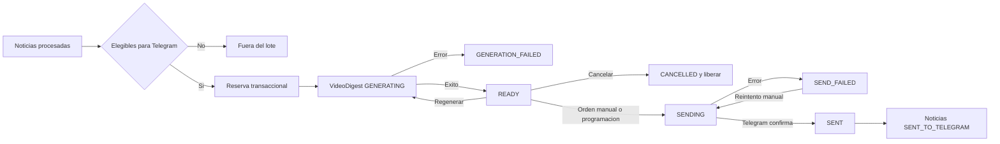

# Videos explicativos de noticias

## Objetivo

El modo `video_digest_manual` agrupa noticias ya procesadas y publicadas en un MP4 narrado. La generacion y el envio siguen siendo operaciones independientes: generar nunca llama a Telegram. Un video `READY` puede enviarse mediante confirmacion visible del administrador o cuando venza la programacion de Telegram si se ha activado expresamente esa opcion.

No se usan elementos `CollectedSourceItem.PENDING`. Esos registros aun esperan analisis con OpenAI. Tampoco se usa `NewsStatus.REVIEW`, que representa revision editorial. Una noticia pendiente de Telegram es un estado derivado centralizado en `TelegramPendingNewsService`.

Una noticia es elegible cuando:

- Esta `PUBLISHED` y marcada como `telegramWorthy`.
- Supera el umbral de Telegram configurado.
- No tiene `sentToTelegramAt` ni un `TelegramMessage` enviado.
- No esta reservada por otro video.
- No ha sido descartada, enviada ni dejada en revision o error.

## Flujo de estados



Las transiciones se validan en `video/state-machine.ts`. Un digest `SENT` o `CANCELLED` no puede volver a generarse ni enviarse.

## Arquitectura

- `TelegramPendingNewsService`: unica definicion de elegibilidad, consulta, reserva, liberacion e integridad previa al envio.
- `VideoDigestService`: orquestacion de generacion, regeneracion y cancelacion.
- `VideoScriptService`: guion audiovisual JSON de OpenAI, validado con Zod.
- `NarrationService`: genera clips TTS y mide sus duraciones reales.
- `MediaAssetsService`: obtiene imagenes permitidas con proteccion SSRF y crea fondos de reserva.
- `SubtitleService`: construye subtitulos SRT desde el timeline.
- `VideoRenderService`: empaqueta y renderiza la composicion Remotion a H.264/AAC.
- `VideoStorageService`: rutas relativas controladas, temporales y artefactos finales.
- `TelegramService.sendVideoDigest`: subida idempotente con `sendVideo`, invocada manualmente o por el job programado.
- `JobService`: encadena opcionalmente `news_processing` con la generacion y registra los jobs con progreso.

## Modelo de datos

`VideoDigest` conserva estado, configuracion de render, hashes, guion, timeline, rutas protegidas, metricas, errores e intentos. `VideoDigestItem` guarda el snapshot historico y el hash de revision de cada noticia. `NewsItem.videoDigestReservationId` representa exclusivamente la reserva activa.

`TelegramMessage.kind` diferencia `NEWS_TEXT` y `VIDEO_DIGEST`. Un envio de video crea un solo registro enlazado al digest, no uno por noticia. La migracion incorpora una restriccion PostgreSQL que exige el destino apropiado para cada tipo.

## Reserva e integridad

La seleccion usa una transaccion serializable y un advisory lock de PostgreSQL. El orden es determinista: primero las noticias mas antiguas, despues mayor `overallScore` y finalmente ID. El lote se limita mediante `video.maxNewsItems` y, por defecto, solo se permite un digest abierto.

La transaccion crea el digest, reclama todas las noticias y almacena sus snapshots. OpenAI, TTS y Remotion se ejecutan despues, fuera de la transaccion.

Cada item tiene `sourceRevisionHash` y el digest tiene `inputHash`. Antes del envio se vuelven a consultar las noticias y se comprueban estado, reserva y hashes. Una edicion posterior bloquea el envio y exige regenerar el mismo digest. Las noticias nuevas nunca se incorporan a un video `READY`.

## Generacion

El pipeline realiza estas fases:

1. Reserva noticias elegibles.
2. Genera un guion JSON con OpenAI Responses y verifica que no invente noticias o fuentes.
3. Genera audio por secciones mediante OpenAI Text-to-Speech.
4. Mide los WAV y construye el timeline con duraciones reales.
5. Descarga imagenes seguras o usa fondos locales de reserva.
6. Produce SRT cuando los subtitulos estan activos.
7. Renderiza diapositivas, narracion, fuentes y progreso con Remotion.
8. Valida que el MP4 exista y no supere el limite de subida aplicado.
9. Guarda el digest como `READY`, sin tocar Telegram ni el estado de las noticias.

La generacion se puede detener desde Jobs. El `AbortSignal` se comprueba entre fases y se propaga a llamadas y render cuando es posible. Al cancelar se eliminan parciales, el digest queda `CANCELLED` y las reservas se liberan.

## Automatizacion

Hay dos interruptores independientes:

- `video.autoGenerateAfterProcessing`: al terminar `news_processing`, el mismo job reclama noticias elegibles y genera el video. El progreso pasa de OpenAI a guion, TTS, recursos y render. Si no hay noticias o ya existe un digest abierto, termina como no-op.
- `video.autoSendOnSchedule`: cuando vence el contador de Telegram o se invoca `/api/cron/telegram` en su franja, el job busca videos `READY` y envia el mas antiguo. Nunca envia noticias individuales en modo video.

La programacion automatica solo selecciona `READY`. Un digest `SEND_FAILED` o con `deliveryUncertain` no se reintenta automaticamente y debe revisarse desde el panel. La adquisicion atomica de `SENDING` sigue evitando envios duplicados si coinciden el boton, el contador y el cron.

El contador del navegador y el cron usan el mismo endpoint con una marca de ejecucion programada. En hosting, el cron es el mecanismo que mantiene el flujo aunque nadie tenga `/admin/jobs` abierto.

## Revision y envio manual

1. Abre `/admin/jobs` y pulsa `Generar video con noticias pendientes`.
2. Sigue la barra y los mensajes de progreso.
3. Abre `/admin/videos` y entra en el digest `READY`.
4. Reproduce el MP4 desde la ruta multimedia protegida.
5. Pulsa `Enviar video a Telegram` y confirma la accion.

El envio adquiere `SENDING` mediante una actualizacion condicional. Dos clics simultaneos no pueden adquirirlo. Solo entonces crea un `TelegramMessage` `PENDING` y sube el MP4 por multipart.

Tras una respuesta positiva de Telegram, una unica transaccion marca el mensaje y el digest como enviados, actualiza todas las noticias a `SENT_TO_TELEGRAM`, fija `sentToTelegramAt` y libera las reservas. Si Telegram confirma un error, el digest queda `SEND_FAILED`, las noticias permanecen publicadas y se permite un reintento manual.

Una perdida de conexion durante la respuesta puede dejar `deliveryUncertain`. Para evitar duplicados, el panel exige comprobar el grupo y confirmar expresamente que no se recibio antes de habilitar otro intento.

## Cancelacion

`Cancelar y liberar` requiere confirmacion. Conserva `VideoDigestItem` como auditoria, cambia el digest a `CANCELLED`, limpia temporales y deja las noticias `PUBLISHED`, sin `sentToTelegramAt` y disponibles para un lote futuro. Un proceso de render tardio no puede devolver un digest cancelado a `READY` porque la actualizacion final tambien comprueba el estado.

## Configuracion

La base de datos tiene prioridad y `.env` actua como fallback:

```env
TELEGRAM_DELIVERY_MODE="legacy_individual"
VIDEO_ENABLED="false"
VIDEO_AUTO_GENERATE_AFTER_PROCESSING="false"
VIDEO_AUTO_SEND_ON_SCHEDULE="false"
VIDEO_MAX_NEWS_ITEMS="6"
VIDEO_MAX_OPEN_DIGESTS="1"
VIDEO_TARGET_DURATION_SECONDS="150"
VIDEO_WIDTH="1920"
VIDEO_HEIGHT="1080"
VIDEO_FPS="30"
VIDEO_LANGUAGE="es-ES"
VIDEO_TTS_PROVIDER="openai"
VIDEO_TTS_MODEL="gpt-4o-mini-tts"
VIDEO_TTS_VOICE="cedar"
VIDEO_OUTPUT_DIRECTORY="./data/video-digests"
```

El panel `/admin/settings` tambien configura subtitulos, temporales y retencion. Los limites Zod evitan lotes, resoluciones, FPS, duraciones y rutas inseguras.

Para activar el flujo automatico:

1. Configura OpenAI y Telegram como en el flujo existente.
2. En `/admin/settings`, activa `Videos explicativos`.
3. Selecciona `Video agrupado: envio manual o programado` como modo de Telegram.
4. Activa `Generar al terminar OpenAI`.
5. Activa `Enviar al vencer el contador de Telegram` si deseas entrega programada.
6. Activa los envios automaticos de Telegram y guarda.
7. En `/admin/jobs`, guarda las horas de recogida, procesamiento y Telegram.

Los dos interruptores tambien aparecen dentro de las tarjetas de programacion de Jobs. Desactivarlos conserva el procesamiento de OpenAI y el envio manual sin eliminar horarios.

Para volver al sistema anterior, selecciona `Noticias individuales (modo anterior)`. Es el valor predeterminado y mantiene la compatibilidad de instalaciones existentes.

## TTS, Remotion y almacenamiento

El proveedor real es OpenAI TTS y utiliza la misma clave cifrada de OpenAI. El proveedor `mock` genera WAV validos para desarrollo y nunca debe confundirse con una voz de produccion. La portada informa que el guion y la voz se han generado con IA. `npm run video:preview` abre Remotion Studio y `npm run video:demo` produce un MP4 real con datos y TTS simulados, sin base de datos ni Telegram.

OpenAI genera el guion y la narracion. Remotion compone el MP4 de forma determinista con los snapshots, imagenes, fuentes y subtitulos validados. Esta separacion evita que un generador visual creativo cambie cifras, marcas o hechos de una noticia empresarial.

Los videos se guardan fuera de `/public`, bajo `VIDEO_OUTPUT_DIRECTORY`. La previsualizacion usa una ruta admin autenticada con soporte Range. Las claves almacenadas son rutas relativas y se validan contra path traversal.

Remotion necesita Chromium y FFmpeg o sus binarios compatibles, ademas de las librerias de sistema requeridas en Linux. El primer render puede descargar el navegador. El render local validado de este MVP utilizo 1280x720 a 24 FPS; produccion puede usar los valores configurados.

## Instalacion y ejecucion

```powershell
npm install
npm run db:deploy
npm run db:generate
npm run test
npm run video:demo
npm run dev
```

La migracion creada es `prisma/migrations/20260714110000_add_video_digests/migration.sql`.

## Despliegue

La primera version esta orientada a un proceso Node.js persistente. Para un servidor inicial se recomienda partir de 4 vCPU, 8 GB de RAM y almacenamiento persistente, y medir con la resolucion y volumen reales. El render consume CPU, memoria y puede tardar varios minutos.

No se ha validado renderizar Remotion dentro de una funcion Vercel/serverless. Sus limites de tiempo, memoria y filesystem efimero pueden cortar el render o eliminar el MP4. Para produccion conviene separar un worker persistente, usar una cola externa y guardar artefactos en S3, R2 o Supabase Storage. El frontend Next.js puede desplegarse por separado.

Los costes externos dependen del texto usado para el guion, del audio TTS, de la infraestructura de render, del almacenamiento y del trafico de subida. Telegram no sustituye el almacenamiento de auditoria local.

## Retencion

Los temporales se eliminan al terminar salvo que `keepTempFiles` este activo. `retentionDays` y `failedRetentionDays` ya se guardan y se muestran en configuracion, pero este MVP aun no incluye un job programado que purgue automaticamente MP4 finales o fallidos. Hasta incorporarlo, la limpieza de artefactos finales debe gestionarse operativamente y nunca mientras un digest este `READY`, `SENDING` o tenga entrega incierta.

## Seguridad

- Endpoints de jobs protegidos por sesion admin o `CRON_SECRET`.
- Acciones de envio, cancelacion y reconciliacion protegidas por sesion admin.
- Media protegida; ningun MP4 pendiente se publica en `/public`.
- Descargas visuales con protocolos permitidos, resolucion DNS, bloqueo de redes privadas, timeout y limite de bytes.
- Rutas confinadas al directorio de almacenamiento.
- Procesos sin comandos de shell construidos con contenido de noticias.
- Logs sin API keys, tokens, binarios ni transcripciones completas.

## Problemas comunes

- `No hay noticias elegibles`: comprueba que sean `PUBLISHED`, `telegramWorthy`, superen el umbral y no esten enviadas o reservadas.
- `Ya existe un video abierto`: revisalo, envialo o cancelalo antes de generar otro.
- `Necesita regeneracion`: una noticia incluida cambio despues del render.
- Error TTS: comprueba clave, facturacion, modelo y voz de OpenAI.
- Error de Chromium/FFmpeg en Linux: instala las dependencias de sistema que indique Remotion y verifica permisos de escritura.
- Error de Telegram por tamano: reduce duracion, resolucion o FPS y vuelve a generar.
- Entrega incierta: comprueba manualmente el grupo; no reintentes a ciegas.
